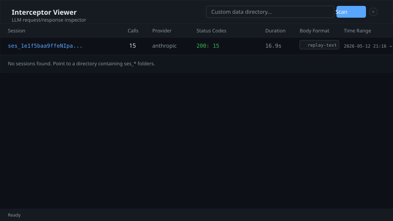
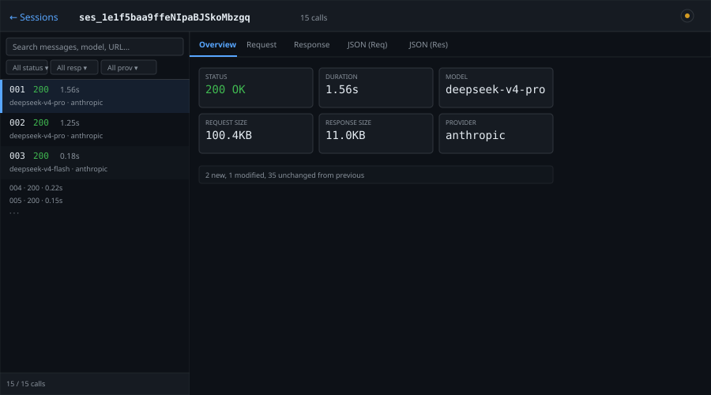
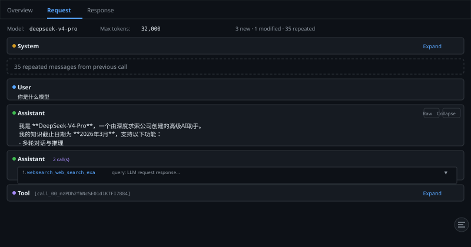
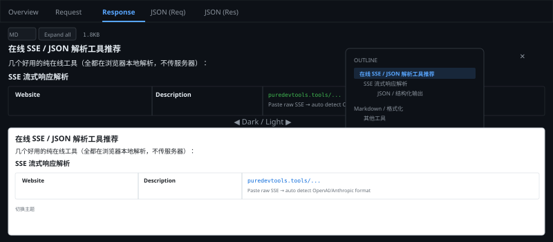

<p align="center">
  
</p>

<h3 align="center">Local web UI for browsing <code>opencode-interceptor</code> LLM traffic</h3>
<h4 align="center">本地网页工具：浏览 <code>opencode-interceptor</code> 抓取的 LLM 请求/响应数据</h4>

<p align="center">
  <a href="#quick-start">Quick Start</a> ·
  <a href="#features">Features</a> ·
  <a href="#screenshots">Screenshots</a> ·
  <a href="#project-structure">Structure</a> ·
  <a href="#中文说明">中文说明</a>
</p>

<p align="center">
  
  
  
  
  
</p>

---

## Quick Start

```bash
git clone https://github.com/ColaHikari/opencode-interceptor-viewer.git
cd opencode-interceptor-viewer
npm install
npm run dev     # http://localhost:3000
```

By default it reads session data from `tests/fixtures/`. To use your own:

```bash
export INTERCEPTOR_DATA_DIR=/tmp/opencode-interceptor/
npm run dev
```

Or enter the path directly in the web UI.

## Features

### English

| Category | Feature |
|----------|---------|
| **Timeline** | Ordered call list with status, duration, model, and badge tags (Error / Empty / Parse Error) |
| **Diffing** | Cross-call message comparison — repeated messages auto-folded, modified messages with diff view, new messages highlighted |
| **Markdown** | GitHub Flavored Markdown (tables, task lists, strikethrough) + syntax highlighting via `rehype-highlight` |
| **Outline** | Auto-extracted heading tree for long responses — click to jump, floating panel |
| **Tool Calls** | Human-readable display — parsed function name + arguments, grouped with tool results |
| **Search** | Full-text across messages, model, URL, response body |
| **Filters** | Status (2xx/4xx/5xx), empty response, provider, model name |
| **Theme** | Dark / Light mode with smooth transitions, localStorage persistence |
| **JSON Viewer** | Collapsible tree view with full-length string display |
| **Export** | Raw JSON tabs for both request and response |

### 中文

| 分类 | 功能 |
|------|------|
| **时间线** | 按顺序展示所有调用，含状态码、耗时、模型、标签（错误/空响应/解析异常） |
| **差异对比** | 相邻请求消息对比 — 重复消息自动折叠，修改消息展示 diff，新增消息高亮 |
| **Markdown** | GitHub 风格 Markdown（表格、任务列表、删除线）+ 语法高亮 |
| **大纲导航** | 长响应自动提取标题树，点击跳转，浮动面板 |
| **工具调用** | 人类可读展示 — 解析函数名 + 参数，工具结果与调用自动分组 |
| **搜索** | 全文搜索消息、模型名、URL、响应体 |
| **过滤** | 状态码（2xx/4xx/5xx）、空响应、provider、模型名 |
| **主题** | 暗色/亮色模式切换，localStorage 持久化 |
| **JSON 查看** | 可折叠树展示，字符串完整显示不截断 |
| **原始数据** | 请求和响应独立 JSON 标签页 |

## Screenshots

### Session List



### Session Detail — Overview



### Request Tab — Message Diffing



### Response Tab — Markdown + Outline



## Development

```bash
npm test              # unit + integration (vitest)
npm run test:e2e      # e2e smoke tests
npm run lint          # eslint
npm run build         # production build
```

## Project Structure

```
├── app/
│   ├── page.tsx                       # Homepage — session list with search input
│   ├── sessions/[id]/page.tsx         # Session detail — timeline + call viewer
│   ├── api/sessions/route.ts          # GET /api/sessions
│   ├── api/sessions/[id]/route.ts     # GET /api/sessions/:id
│   ├── api/search/route.ts            # GET /api/search?q=
│   ├── globals.css                    # Theme tokens, typography plugin, dark variant
│   └── layout.tsx                     # Root layout with anti-flash theme script
├── components/
│   ├── CallDetail.tsx                 # 5-tab viewer (Overview/Request/Response/JSON×2)
│   ├── MessageBlock.tsx               # Single message — role badge, fold, MD/Raw toggle
│   ├── MarkdownRenderer.tsx           # Markdown + outline panel + scroll tracking
│   ├── DiffView.tsx                   # LCS line-diff with hunk prev/next navigation
│   ├── ToolCallView.tsx               # Tool call human-readable display
│   ├── JsonViewer.tsx                 # Collapsible JSON tree
│   ├── ThemeProvider.tsx              # Theme context + localStorage
│   └── ThemeToggle.tsx                # Sun/moon icon toggle button
├── lib/
│   ├── parser.ts                      # Server-side — scan dirs, parse JSON, normalize data
│   ├── message-utils.ts               # Client-safe — diffMessages, computeDiff, parseToolCalls
│   ├── types.ts                       # TypeScript interfaces
│   └── utils.ts                       # Shared formatters + MD_PROSE CSS constant
└── tests/
    ├── unit/                          # Parser + component unit tests
    ├── integration/                   # API route integration tests
    ├── e2e/                           # Full-stack smoke tests
    ├── fixtures/                      # Real interceptor data + synthetic test data
    └── setup.ts                       # jest-dom matchers
```

## Tech Stack

| Layer | Technology |
|-------|-----------|
| Framework | Next.js 16 (App Router) |
| UI | React 19 + Tailwind CSS 4 |
| Typography | `@tailwindcss/typography` |
| Markdown | `react-markdown` + `remark-gfm` + `rehype-highlight` |
| Testing | Vitest 4 + Testing Library + Playwright (e2e) |
| Linting | ESLint + `eslint-config-next` |

---

## 中文说明

`opencode-interceptor-viewer` 是一个本地网页工具，用于可视化浏览 [`opencode-interceptor`](https://github.com/anomalyco/opencode-interceptor) 抓取的 LLM 调用数据。

### 数据格式

Interceptor 把每次 LLM 调用拆成三个 JSON 文件：

| 文件 | 内容 |
|------|------|
| `*.meta.json` | 请求元信息：URL、状态码、耗时、字节数 |
| `*.request.json` | 完整请求体：model、messages、tools、参数 |
| `*.response.json` | 响应数据：body（重建文本）、bodyFormat、错误信息 |

### 核心设计

**消息差异对比** — 查看相邻两次请求的消息变化：

```
call N-1:  [sys, user, assistant, tool, user]     ← 5 messages
call N:    [sys, user, assistant, tool, user, assistant (new!)]

显示:  [5 repeated 折叠] → [assistant 新增，展开]
```

**折叠策略**：
- System prompt → 始终可折叠，显示大小 + 是否变化
- 重复消息组 → 按连续段独立折叠
- Tool 结果 → 超过 500 字符默认折叠

**不做的事**：
- 不修改 interceptor 原始文件
- 不忽略 system prompt 任何部分
- 不去掉 `<system-reminder>` 包装
- 单个文件解析失败不影响整个 session 打开

## License

MIT
