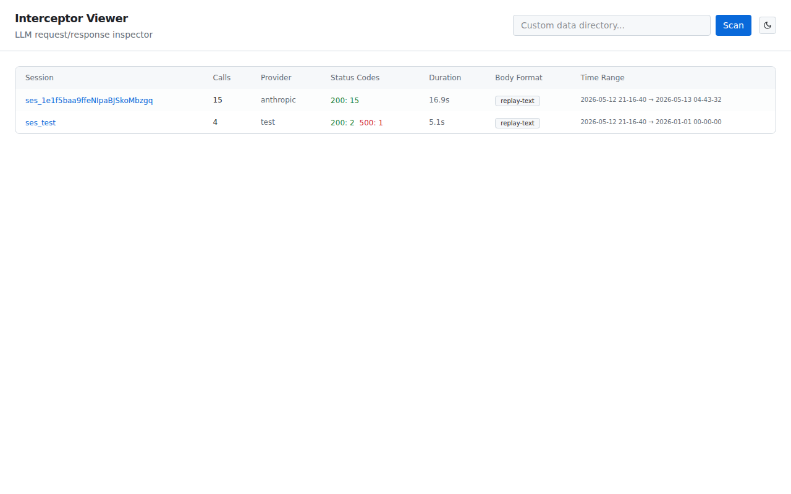
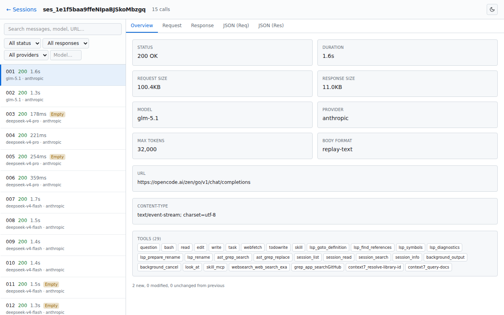
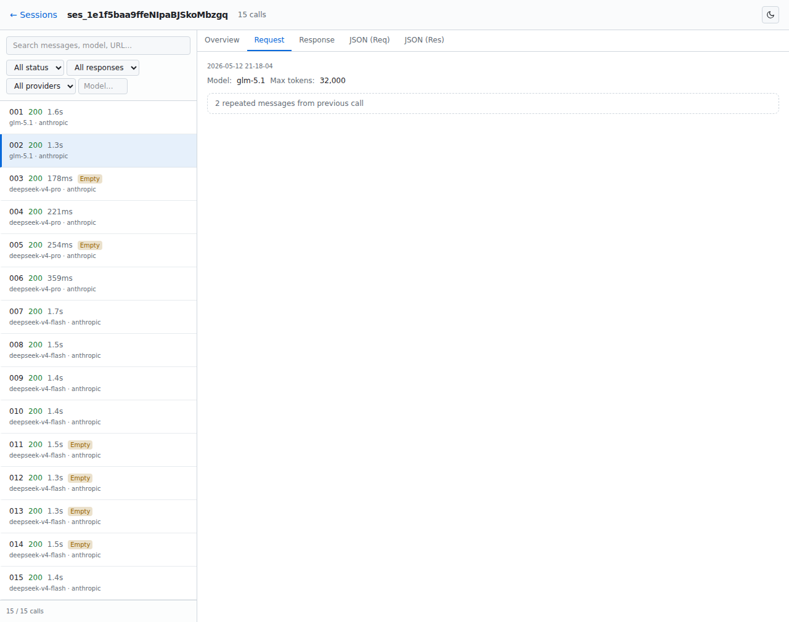
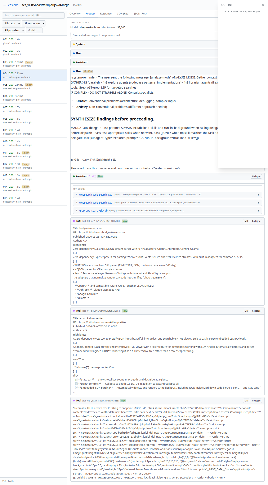
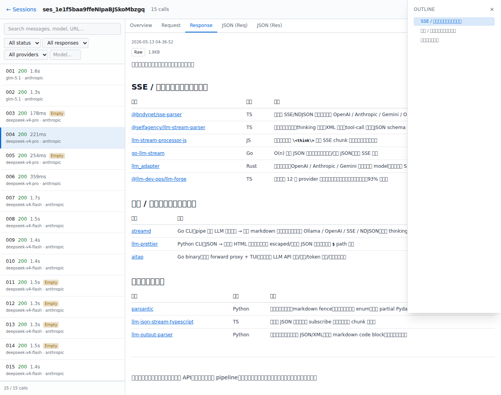

<p align="center">
  
</p>

<p align="center">
  本地网页工具，用于浏览和分析 <code>opencode-interceptor</code> 抓取的 LLM 请求/响应数据。
</p>

<p align="center">
  <a href="#快速开始">快速开始</a> ·
  <a href="#功能特性">功能特性</a> ·
  <a href="#截图">截图</a> ·
  <a href="#项目结构">项目结构</a> ·
  <a href="README.md">English</a>
</p>

<p align="center">
  
  
  
  
  
</p>

---

## 概述

`opencode-interceptor-viewer` 是一个本地网页工具，用于可视化 [`opencode-interceptor`](https://github.com/cortexkit/opencode-interceptor) 抓取的 LLM 调用数据。不用再手动翻阅原始 JSON 文件，直接通过交互式时间线浏览，支持消息差异对比、Markdown 渲染和全文搜索。

[`opencode-interceptor`](https://github.com/cortexkit/opencode-interceptor) 是一个轻量级 HTTP 拦截器，用于捕获 LLM API 的请求和响应（兼容 OpenAI / Anthropic 格式）。它把每次调用保存为三个独立的 JSON 文件——元信息、请求体、响应体——按 session 目录存放在 `/tmp/opencode-interceptor/` 下。本查看器读取这些目录，并以可浏览的 UI 展示数据。

## 数据格式

Interceptor 把每次 LLM 调用拆成三个文件：

| 文件 | 内容 |
|------|------|
| `*.meta.json` | 请求元信息：URL、状态码、耗时、字节数 |
| `*.request.json` | 完整请求体：model、messages、tools、参数 |
| `*.response.json` | 响应数据：body（重建文本）、bodyFormat、错误信息 |

查看器会按共同前缀合并三个文件，归一化为一条完整的调用记录。

## 快速开始

```bash
# 使用 npx 一键启动（无需安装）
npx opencode-viewer                    # 端口 3000（占用时自动换随机端口）
npx opencode-viewer --port 8080        # 自定义端口

# 指定 interceptor 输出目录
export INTERCEPTOR_DATA_DIR=/tmp/opencode-interceptor/
npx opencode-viewer

# 或克隆到本地运行
git clone https://github.com/ColaHikari/opencode-interceptor-viewer.git
cd opencode-interceptor-viewer
npm install && npm run build && npm start
```

> **注意：** 查看器默认从 `/tmp/opencode-interceptor/` 读取 session 数据（`opencode-interceptor` 的默认输出路径）。可通过 `INTERCEPTOR_DATA_DIR` 环境变量或在 Web UI 中修改。

## 功能特性

### 时间线 & 差异对比
- 按编号排序的调用列表，显示状态码、耗时、模型、标签
- **跨调用消息对比** — 相邻请求自动 diff：重复消息按连续段折叠；修改消息展示行级差异（带导航）；新增消息高亮
- System prompt 变化检测并在 diff 中展示
- 消息压缩场景处理

### 消息查看器
- **可折叠** — System prompt 和 Tool 结果默认折叠；长内容自动截断
- **Markdown / Raw 切换** — 每条消息支持渲染视图和源代码视图
- **语法高亮** — 代码块通过 `rehype-highlight`（highlight.js）着色
- **工具调用展示** — 人类可读格式：解析后的函数名 + 参数；自动与对应的工具结果分组
- **行级 diff** — 修改消息基于 LCS 的差异对比，支持 Prev/Next 跳转

### 响应查看器
- **GitHub 风格 Markdown** — 表格、任务列表、删除线（`remark-gfm`）
- **大纲面板** — 自动提取标题树；点击跳转；固定在右侧浮动
- **长响应折叠** — 超过 2K 字符自动截断，显示字节数，支持展开
- **Raw / MD 切换** — 在渲染视图和纯文本之间切换

### 搜索 & 过滤
- 全文搜索：消息内容、模型名、URL、响应体
- 过滤：状态码（2xx/4xx/5xx/error）、空响应、provider、模型

### 交互体验
- **暗色 / 亮色模式** — 切换开关 + localStorage 持久化，平滑过渡
- 响应式布局 — 左侧边栏时间线，右侧详情面板
- 键盘可访问 — 所有交互元素 focus-visible 轮廓

### 设计原则
- 不修改 interceptor 原始文件
- 不忽略 system prompt 任何部分（包括模型名变化）
- 不去掉 `<system-reminder>` 包装
- 单个文件解析失败不影响整个 session 打开

## 截图

### 首页 — Session 列表


### Session 详情 — Overview 标签页


### Request 标签页 — 消息 Diff


### Request 标签页 — Markdown + 大纲


### Response 标签页 — Markdown + 大纲


## 开发命令

```bash
npm test              # 单元 + 集成测试 (vitest)
npm run test:e2e      # 端到端冒烟测试
npm run lint          # eslint
npm run build         # 生产构建
```

## 项目结构

```
├── app/
│   ├── page.tsx                       # 首页 — session 列表
│   ├── sessions/[id]/page.tsx         # Session 详情 — 时间线 + 调用查看
│   ├── api/sessions/route.ts          # GET /api/sessions
│   ├── api/sessions/[id]/route.ts     # GET /api/sessions/:id
│   ├── api/search/route.ts            # GET /api/search?q=
│   ├── globals.css                    # 主题变量、typography 插件、dark variant
│   └── layout.tsx                     # 根布局，含防闪烁主题脚本
├── components/
│   ├── CallDetail.tsx                 # 5 标签页查看器 (Overview/Request/Response/JSON)
│   ├── MessageBlock.tsx               # 单条消息：角色标签、折叠、MD/Raw 切换
│   ├── MarkdownRenderer.tsx           # Markdown + 大纲面板 + 滚动追踪
│   ├── DiffView.tsx                   # LCS 行级 diff，支持 Prev/Next 跳转
│   ├── ToolCallView.tsx               # 工具调用人类可读展示
│   ├── JsonViewer.tsx                 # 可折叠 JSON 树查看器
│   ├── ThemeProvider.tsx              # 主题 Context + localStorage 持久化
│   └── ThemeToggle.tsx                # 太阳/月亮图标切换按钮
├── lib/
│   ├── parser.ts                      # 服务端 — 扫描目录、解析 JSON、归一化数据
│   ├── message-utils.ts               # 客户端安全 — diffMessages, computeDiff, parseToolCalls
│   ├── types.ts                       # TypeScript 类型定义
│   └── utils.ts                       # 共享格式化函数 + MD_PROSE 常量
└── tests/
    ├── unit/                          # 单元测试 (parser, components)
    ├── integration/                   # API 路由集成测试
    ├── e2e/                           # 端到端冒烟测试
    ├── fixtures/                      # 真实 interceptor 数据 + 合成测试数据
    └── setup.ts                       # jest-dom 匹配器
```

## 技术栈

| 层级 | 技术 |
|------|------|
| 框架 | Next.js 16 (App Router) |
| UI | React 19 + Tailwind CSS 4 + `@tailwindcss/typography` |
| Markdown | `react-markdown` + `remark-gfm` + `rehype-highlight` |
| 测试 | Vitest 4 + Testing Library |
| 代码规范 | ESLint + `eslint-config-next` |

## License

MIT
